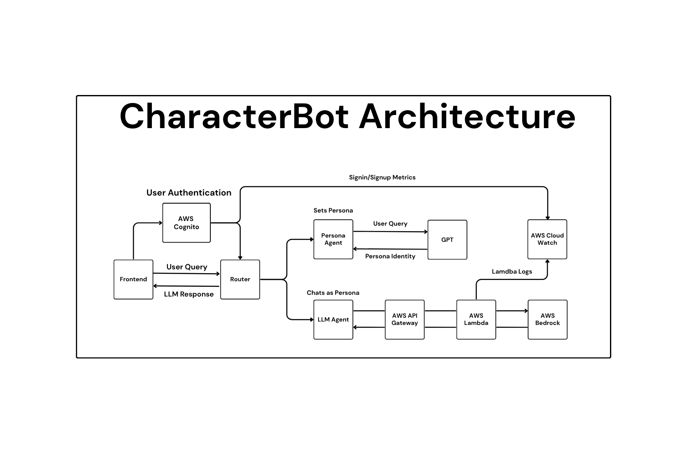

# CharacterBot

## Architecture Documentation

### Overview
This system is a chatbot that a user can user to interact with a famous character of their choice or make up a persona to talk with. It uses OpenAI's gpt-4o-mini model with structured outputs to create the persona and leverages Amazon's proprietary chat model through Bedrock for the chat interaction.

### Architecture Diagram



### Flow
1. A user can either sign-in or create an account which is authenticated through AWS Cognito
2. A user is prompted to select any persona of their choosing
3. Their response is sent through the router to the Persona Agent to GPT to extract the persona and a description (through OpenAI's structured output feature) to be supplied to Bedrock
4. The user can begin chatting with the new persona
5. From then on, the user can interact with the chatbot as normal. All requests will be routed through API Gateway to the lambda that calls bedrock
6. Logs are sent to CloudWatch from AWS Cognito and AWS Lambda for security and performance monitoring 

### Components

1. Frontend (Optional): 
    - React Native frontend 

2. Backend:
    - Amazon Cognito is used as the base for the authentication service
    - A router is used to either send a prompt to the persona agent or to bedrock
    - API Gateway to interact with the lambda
    - AWS lambda to send requests to Bedrock
    - AWS Bedrock for the chat interactions
    - AWS Cloudwatch for monitoring and logging
    - OpenAI for persona determination

### Requirements

1. Backend
```python
openai==1.86.0
python-dotenv==1.1.0
requests==2.32.4
flask==3.1.1
flask-cors==6.0.1
pytest==8.4.0
pytest-cov==6.1.1
pydantic==2.11.5
```

2. Frontend
    - Node v23.11.0

### Model Configuration

1. OpenAI
    - Model: gpt-4o-mini
    - Method: beta.chat.completions.parse()
    - Schema enforcement: Via structured outputs

2. Bedrock
    - Model: amazon.nova-micro-v1:0
    - Method: bedrock.invoke_model()
    - Schema enforcement: None

## User Guide

### What It Does
This chatbot allows you to interact with any persona of your choosing. From historical figures to superheros, CharacterBot is a fun and new way to interact with your favorite characters.

### How to install

1. Clone this repository 
```bash
git clone https://github.com/notthattal/AwsGenAIImplementation.git
cd AwsGenAIImplementation
```

2. Create and activate a virtual environment
```bash
python -m venv venv
source venv/bin/activate
```

3. Install the requirements for the backend
```bash
pip install -r requirements.txt
```

4. Start the requirements for the frontend
```bash
cd frontend
npm install
``` 

5. Start the frontend
```bash
npm run dev
```

6. Start the backend *(In a new terminal pointing to the project root directory)*
```bash
python server.py
```

7. Run tests and test for coverage *(Optional)*
```bash
pytest --cov=.
```

### How to use

1. Create an account or sign-in
2. Verify your account (if first time signing in)
3. Tell CharacterBot which persona you would like to speak to
4. Chat like you would with any other chatbot! It's that easy!

## Security Documentation

### API Key Management

- API keys are stored using environment variables.
- They are never hardcoded anywhere in source code or frontend files.

### Input Validation and Sanitization

- Inputs are schema-validated before processing.
- AWS Bedrock Guardrails are used to enforce prompt safety and block malicious instructions.
- Unsafe or malformed inputs are automatically handled via Bedrock’s `guardrailConfig` policies.

### Authentication and Authorization

- AWS Cognito handles all user authentication flows.
- API Gateway is configured with a Cognito Authorizer to verify JWT tokens for each request.
- Only verified users are allowed to invoke protected endpoints.
- Lambda functions extract the validated `sub` claim securely from the token via API Gateway's request context.

### Rate Limiting

- Flask backend enforces rate limiting at 25 requests per minute using `flask-limiter`.
- Additional throttling and usage plans can be configured via API Gateway for production deployments.

### Data Handling and Privacy

- No user PII (e.g., emails, names) is logged or stored.
- User identity is tracked internally using the Cognito `sub` UUID only.
- Prompt contents are optionally hashed or archived securely in S3.
- All environment variables and credentials are scoped per environment and never exposed publicly.

### Audit Logging

- Each API invocation is logged to CloudWatch with:
  - Timestamp
  - Cognito user `sub`
  - Request ID
  - Prompt text
  - Model response
- Logs are structured with a consistent `AUDIT_LOG` prefix for easy traceability.
- Request IDs can be correlated with CloudTrail events to determine full invocation context and user action.
- Logs are stored in immutable AWS-managed infrastructure and monitored for unusual patterns.

### Safety Filters and Monitoring

- AWS Bedrock Guardrails apply real-time content moderation policies.
- All prompt/response flows are subject to Bedrock's safety filters.
- AWS CloudWatch is used to monitor API usage, latency, and access patterns.
- All authentication events and access attempts are tracked via CloudTrail for audit compliance.